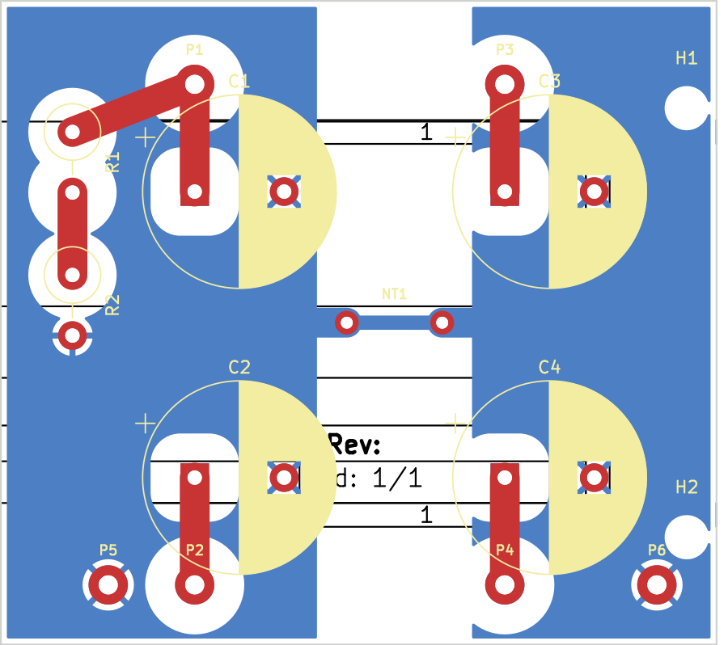

# KiCad project — AA1164 Filter Cap Board

KiCad 7 project for the Princeton Reverb (AA1164) filter-cap board. This is a
**starting point**: electrically complete, ERC/DRC-clean, with the HV creepage
and split-ground rules baked in — but the placement and mechanical fit still
want a pass in the GUI before you fab it.

> Built/validated with KiCad **7.0.11**. KiCad 9 opens it fine (it will offer to
> upgrade the files). The two generator scripts below are the scaffolding used
> to create it; the `.kicad_sch` / `.kicad_pcb` are now the editable sources.



*B.Cu split ground pours (blue) joined only at the NT1 star-tie; F.Cu B+ traces
(red); 2×2 caps with each B+ wire-entry beside its cap; bleeder R1/R2 top-left;
mounting holes right. The wide white rings are the 2.5 mm HV anti-pads in the
pour.*

## Files

| File | What |
|------|------|
| `princeton_reverb_aa1164.kicad_pro` | Project (net classes: 2.5 mm clearance / 2.5 mm tracks) |
| `princeton_reverb_aa1164.kicad_sch` | Schematic — 4 caps, bleeder, 6 wire-entry pads, star-tie, 2 mounts |
| `princeton_reverb_aa1164.kicad_pcb` | 2-layer board: B+ on F.Cu, split GND pours on B.Cu |
| `wire_entry.pretty/` | Custom footprints: `WireEntry_BPlus`, `WireEntry_GND` (1.6 mm hole / 3.3 mm pad), `StarTie_8mm` (net-tie) |
| `fp-lib-table` / `sym-lib-table` | Register the project footprint library |
| `generate_sch.py` / `generate_pcb.py` | The scripts that generated the above (kiutils + pcbnew) |
| `fab/` | Fabrication outputs — see `fab/` |
| `drc.rpt` | Saved DRC run (0 errors) |

## Nets & rules

- B+ nodes are **separate nets** `HV_A..HV_D` (each = wire-entry pad + cap "+",
  plus the bleeder on A) — they only join *outside* the board, in the amp.
- `BLEED_MID` is the junction of the two series bleeder resistors.
- Grounds are **two nets** `GND-PWR` (caps A·B + bleeder) and `GND-PRE`
  (caps C·D), joined **only** at the `NT1` star-tie (a net-tie footprint, so DRC
  permits the single intentional short). Omit/DNP NT1 to run dual returns.
- Board-wide clearance is **2.5 mm** and default track width **2.5 mm** — every
  net here is HV or ground, so one rule enforces the creepage spec everywhere.

## Validation

- **Connectivity** verified by netlist export (matches the intended net map).
- **DRC: 0 errors.** The 12 remaining items are warnings only:
  - `lib_footprint_issues` (8) — headless DRC has no global footprint-library
    table; these disappear in the GUI.
  - `silk_over_copper` (4) — cosmetic cap-outline silk over mask openings.
- KiCad 7's `kicad-cli` has no `erc`/`drc` subcommand (KiCad 8+), so ERC/DRC were
  run via the netlist export and `pcbnew.WriteDRCReport`. **Re-run ERC and DRC in
  your GUI** as a final check after any edits.

## Refine before fabbing

This was placed/routed *blind to the real chassis*. In the GUI:

1. **Verify mechanical fit** — board outline (~60 × 54 mm here vs the ~55–60 × 48
   target), the wire-entry positions against your fiber board, and cap body
   height clearance into the interior.
2. Optionally **regroup the wire-entry pads into one edge row** (they're placed
   next to each cap here for short, clean B+ traces).
3. Confirm the **cap footprints** — all four use `CP_Radial_D16.0mm_P7.50mm`
   (sized for the 47 µF); the 22/33 µF bodies are smaller, so swap to the right
   case once you pick exact parts.
4. Confirm the **bleeder** uses a vertical 2 W footprint that matches your
   resistors, and that the **star-tie** location suits your single chassis tie.
5. Re-run ERC + DRC.

## Regenerating

```sh
pip install kiutils
python3 generate_sch.py      # writes the .kicad_sch
python3 generate_pcb.py      # writes the .kicad_pcb, fills zones, runs DRC
```
Regenerating overwrites GUI edits — once you start editing in KiCad, treat the
`.kicad_sch`/`.kicad_pcb` as the sources and retire the scripts.
