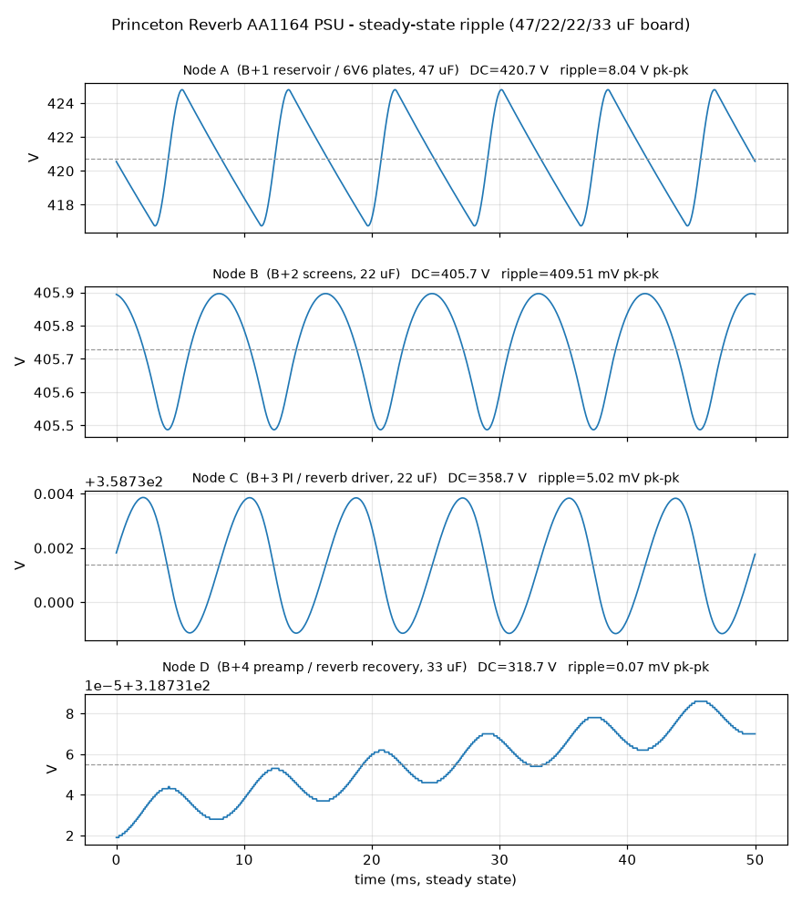

# AA1164 Power-Supply SPICE Sim

ngspice model of the blackface Princeton Reverb (AA1164) high-voltage supply,
used to verify **ripple at each B+ node** and **DC sag** with this board's
filter set (A/B/C/D = **47 / 22 / 22 / 33 µF**) feeding the stock dropping
network.

## Files

| File | Purpose |
|------|---------|
| `aa1164_psu.cir` | ngspice deck — rectifier + filter chain + loads, with a `.control` block that prints DC and ripple per node |
| `plot_ripple.py` | Runs the deck and renders `aa1164_psu_ripple.png` (steady-state ripple per node) |
| `aa1164_psu_ripple.png` | Committed plot of the idle-load result |
| `results.txt` | Saved console output of the idle-load run |

The raw transient dump (`aa1164_psu_nodes.dat`, ~30 MB) is regenerated on every
run and is **git-ignored** — don't commit it.

## Running

```sh
ngspice -b aa1164_psu.cir        # prints the DC/ripple table
python3 plot_ripple.py           # regenerates aa1164_psu_ripple.png
```

Requires `ngspice`, plus `numpy` + `matplotlib` for the plot.

## Circuit model

```
   330-0-330 VAC          GZ34 (2 plates)
   centre-tapped     ┌──►|──┐
   secondary    ─────┤      ├──┬─── A ──[1k]── B ──[4.7k]── C ──[10k]── D
   (CT = gnd)   ─────┤      │  │       │            │            │       │
                     └──►|──┘ 47µF   22µF         22µF         33µF    (each
                               │       │            │            │      to gnd)
                             200k      ▼            ▼            ▼       ▼
                            bleeder  screens   PI/reverb     preamp /
                                     (6V6)      driver      reverb recov
                       6V6 plates ◄──┘
```

- **Rectifier:** GZ34/5AR4 full-wave centre-tap, approximated by a solid-state
  diode with series resistance (`RS=60` in the `.model` + 75 Ω winding R per
  half). This reproduces forward drop and **sag** well, but **not** the GZ34's
  slow indirectly-heated warm-up — that's deliberate; we want steady-state
  numbers, not the turn-on transient (which is exactly why a tube rectifier is
  used: it spares the caps the cold-start surge).
- **Loads** are modelled as DC current sinks per node (tubes ≈ constant-current
  over a line cycle). Idle defaults: A 45 mA, B 5 mA, C 6 mA, D 4 mA (~60 mA
  HT total, typical for a Princeton Reverb).
- **Settling:** the deck runs to **8 s**. The downstream RC poles are slow
  (node D ≈ `RCD·CD` = 10 k × 33 µF ≈ 0.33 s); shorter runs leave the chain
  un-settled and report bogus DC/ripple on C and D. Ripple is measured over the
  last 50 ms (6 × 120 Hz cycles).

> Component values are the **standard AA1164** schematic values (PT secondary,
> dropping resistors, loads). Verify against *your* chassis before trusting the
> absolute volts — especially the transformer secondary, which varies with mains
> voltage and PT model. The **ripple** conclusions are robust to small value
> errors; the **DC** levels scale with whatever your secondary actually is.

## Results

### Idle (~60 mA HT) — the committed plot

| Node | Cap | DC (V) | Ripple (pk-pk) |
|------|-----|-------:|---------------:|
| A — reservoir / 6V6 plates | 47 µF | **420.7** | **8.0 V** |
| B — screens | 22 µF | 405.7 | 0.41 V |
| C — PI / reverb driver | 22 µF | 358.7 | 5.1 mV |
| D — preamp / reverb recovery | 33 µF | 318.7 | 0.1 mV |



### Full output (plates ~80 mA, screens ~9 mA) — sag

| Node | DC (V) | Δ vs idle | Ripple (pk-pk) |
|------|-------:|----------:|---------------:|
| A | 403.5 | −17 V | 12.3 V |
| B | 384.5 | −21 V | 0.63 V |
| C | 337.5 | −21 V | 7.9 mV |
| D | 297.5 | −21 V | 0.1 mV |

Reproduce by editing the `.param IA`/`IB` lines near the bottom of the deck.

## What it tells us

- **Node A ≈ 420 V idle**, matching the README's "near 420 V" — the board and
  bleeder rating margin (500 V caps, 200 kΩ bleeder) are correct.
- **Reservoir ripple ~8 V at idle, ~12 V at full output.** That's normal for a
  Princeton-class amp; bumping A from the stock 16 µF to **47 µF** roughly thirds
  the reservoir ripple versus stock, firming the low end.
- **Hum-sensitive nodes are quiet:** screens already at 0.4 V, and the
  PI/preamp nodes (C, D) are filtered to **single-digit mV or below** — well
  under the threshold for audible hum at the preamp.
- **Sag:** node A drops ~17 V plate-to-idle under full output — the GZ34
  "compression" that gives these amps their feel. The larger reservoir trades a
  little of that softness for tighter lows; if you want more sag, that's the
  knob (reservoir µF), not the downstream caps.
- Downstream cap values (B/C/D) buy **no audible ripple improvement** beyond
  stock — consistent with keeping B and C at 22 µF; D's 33 µF is for headroom/
  retunability, not hum.
